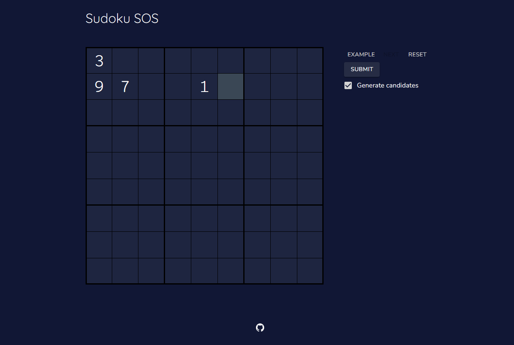
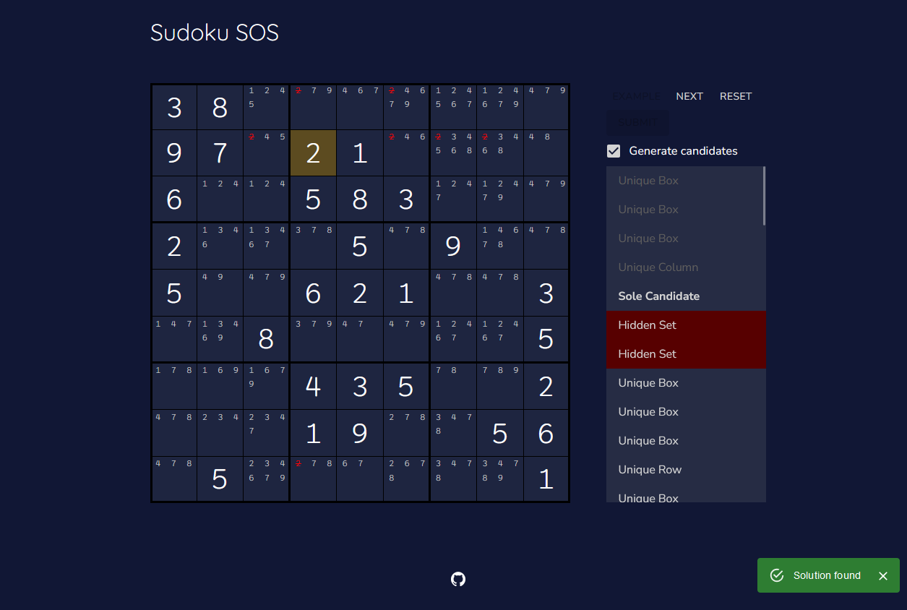

# Sudoku SOS

Sudoku SOS is a web app that uses human solving strategies to solve your Sudoku. It renders a step-by-step list of each action to teach you exactly what to do.

## Features

Currently implements the following solving strategies:
- Sole Candidates
- Unique Candidates
- Naked Sets (Naked Pairs, Naked Triples, Naked Quadruples)
- Hidden Sets (Hidden Pairs, Hidden Triples, Hidden Quadruples)

It also features:
- an efficient Sudoku inputting system
- a navigatable list of steps
- multiple example puzzles
- a mobile-friendly user interface

## Screenshots
### Puzzle input

### Solution and Steps

